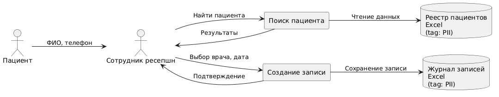
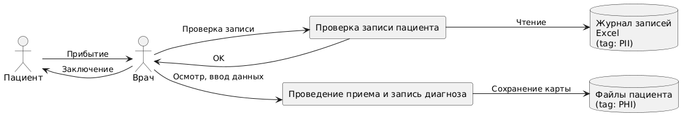
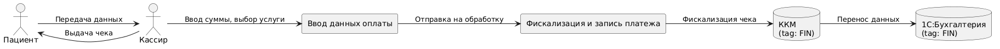
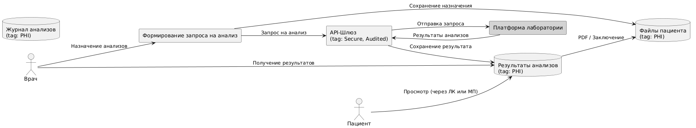
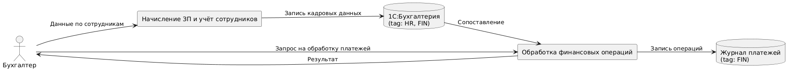

# Анализ безопасности системы компании «Медикаменте»

## 1. Инвентаризация конфиденциальных данных (As‑Is)

| Категория                            | Конкретные атрибуты                                                       | Где сегодня хранится                         | Учтено/не учтено                            |
| ------------------------------------ | ------------------------------------------------------------------------- | -------------------------------------------- | ------------------------------------------- |
| **Пациентские PII**                  | ФИО, дата рождения, паспортные данные, телефон, e‑mail, адрес регистрации | Excel‑журналы ресепшена, сканы договоров     | **Частично** (нет централизованной LMS/CRM) |
| **Медицинские данные**               | Диагнозы, анамнез, результаты анализов, заключения врачей, снимки         | Сканы PDF/JPG и Excel‑карты на сетевом диске | **Не учтены** (нет реестра, нет тегов)      |
| **Финансовые данные пациентов**      | Сумма, способ оплаты, номер кассового чека, банковские реквизиты          | Excel ресепшена, 1С «Бухгалтерия»            | Учтены, но не шифруются                     |
| **Данные о сотрудниках**             | Личные дела, KPI, зарплатные ведомости, медкнижки                         | 1С «Зарплата и кадры», сетевой диск          | Учтены частично                             |
| **Инвентаризационные данные (ТМЦ)**  | Серийные номера, поставщики, счета‑фактуры                                | 1С «Торговля и склад»                        | Учтены                                      |
| **Системные журналы**                | Логи AD, почты, ККМ, 1С                                                   | На Windows Server 2022 без центрального SIEM | **Не консолидированы**                      |
| **API‑трафик лаборатории (будущий)** | ИД заказа, биоматериал, результаты                                        | Не реализовано                               | —                                           |

> **Пробелы**: нет единого каталога данных, отсутствует классификация и юридическое основание хранения, нет инструкции хранения «особых» категорий (СПДн, мед‑тайна).

---

## 2. Краткое описание бизнес‑процессов и потока данных (DFD‑уровень 0 → 1)

### 2.1. «Запись на приём»

**Описание:**

1. Пациент звонит или обращается на ресепшен.
2. Сотрудник ресепшена идентифицирует пациента по ФИО/телефону.
3. Информация записывается в **журнал Excel**.
4. Расписание отправляется врачам по Outlook.
5. За день до приёма ресепшен обзванивает пациентов.

**Данные:** PII (ФИО, телефон, дата приёма)

**Уязвимости:**

* Файл Excel рассылается без шифрования.
* Нет аудита: невозможно отследить, кто копировал или изменял.
* Отсутствует централизованный доступ и разграничение прав.

---

### 2.2. «Приём и оформление медкарты»

**Описание:**

1. Врач сверяется с журналом приёмов.
2. Проводит осмотр пациента.
3. Пишет заключение вручную, затем сканирует его.
4. JPG‑файл загружается в папку пациента на сетевом диске.

**Данные:** PHI (диагнозы, история болезни)

**Уязвимости:**

* Все файлы доступны любому сотруднику с доступом к общей папке.
* Нет RBAC, версионирования, или логирования доступа.
* Файлы хранятся в открытом формате (JPG) без тегов безопасности.

---

### 2.3. «Оплата и касса»

**Описание:**

1. Пациент подходит к кассиру и предоставляет данные об услуге.
2. Кассир вводит данные в 1С + пробивает чек через ККМ.
3. ККМ отправляет данные в бухгалтерскую систему.
4. Часть данных дублируется в Excel вручную.

**Данные:** PII + FIN (ФИО, сумма, дата, ИНН)

**Уязвимости:**

* Дублирование данных между Excel и 1С → риск рассинхронизации.
* Нет защиты конфиденциальных данных в канале (TCP/IP без шифрования).
* У IT-админа есть доступ ко всем чекам в 1С без разграничений.
* Пароли к 1С хранятся в registry на сервере.

---

### 2.4. «Лабораторные анализы»

**Описание:**

1. Врач назначает анализы пациенту.
2. Через API‑шлюз формируется запрос в лабораторию.
3. Лаборатория передаёт результат через API обратно.
4. Результаты сохраняются в системе и дублируются в папку пациента.

**Данные:** PHI (назначения, результаты анализов)

**Уязвимости:**

* Внешняя интеграция не покрыта контрактами (OpenAPI отсутствует).
* API не проверяет контекст вызова (нет RBAC/ABAC).
* Данные сохраняются в PDF без шифрования и аудита доступа.
* Возможность просмотра результатов других пациентов при ошибке фильтрации.

---

### 2.5. «Кадровый учет и бухгалтерия»

**Описание:**

1. Бухгалтер начисляет зарплаты, ведёт кадровый учет в 1С.
2. Сотрудники кассы передают данные о платежах.
3. 1С формирует проводки, отчёты и ведомости.
4. Финансовые документы обрабатываются вручную, затем выгружаются в PDF.

**Данные:** PII + HR + FIN (ФИО, СНИЛС, ЗП, ИНН)

**Уязвимости:**

* Нет сквозной валидации данных от кассы до ЗП.
* Нет разграничения доступа по ролям (один логин — несколько пользователей).
* Отчеты выгружаются в открытом виде, без журналирования.

---

* **Отсутствие централизованной IAM** (RBAC/ABAC) во всех системах.
* **Нет Data Lineage** — не отслеживается, как данные переходят между системами.
* Все бизнес-процессы завязаны на **ручной ввод**, **локальные Excel-файлы** и **общие папки**, что критически снижает безопасность и масштабируемость.

---

## 3. Улучшние и внедрение инструментов тегирования

## Структура диаграмм

Каждая диаграмма включает:

* *входные данные* (например, ФИО, диагноз, платеж),
* *точки обработки* (форма, 1С, API),
* *систему хранения или передачи* (Excel, сетевой диск, внешняя лаборатория),
* *механизмы защиты* (`Encrypted`, `RBAC`, `Audited`, `SecureInput`),
* *теги безопасности* (`tag: PII`, `tag: PHI`, `tag: FIN`, `tag: HR`).

Обновленные диаграммы находятся в папке `dfd_diagrams/to-be/`

---

## Категории защищаемых данных и меры

| Данные                        | Способы защиты                          |
| ----------------------------- | --------------------------------------- |
| **Персональные данные (PII)** | AES-256 шифрование, обезличивание       |
| **Медицинские данные (PHI)**  | AES-256, обфускация, аудит              |
| **Финансовые данные (FIN)**   | Шифрование, токенизация                 |
| **HR-данные (кадровые)**      | Шифрование, доступ по ролям (RBAC/ABAC) |

---

## Используемые инструменты

| Цель                          | Инструмент                        |
| ----------------------------- | --------------------------------- |
| **Тегирование данных**        | Apache Atlas, Alation             |
| **Шифрование**                | OpenSSL, AWS KMS                  |
| **Обфускация / маскирование** | DataSunrise, Delphix              |
| **Управление доступом (IAM)** | Keycloak (JWT, OAuth2, RBAC/ABAC) |
| **Аудит / Логирование**       | Wazuh, Graylog, ELK stack         |
| **API Gateway / Защита API**  | Kong, OPA / Gatekeeper            |
