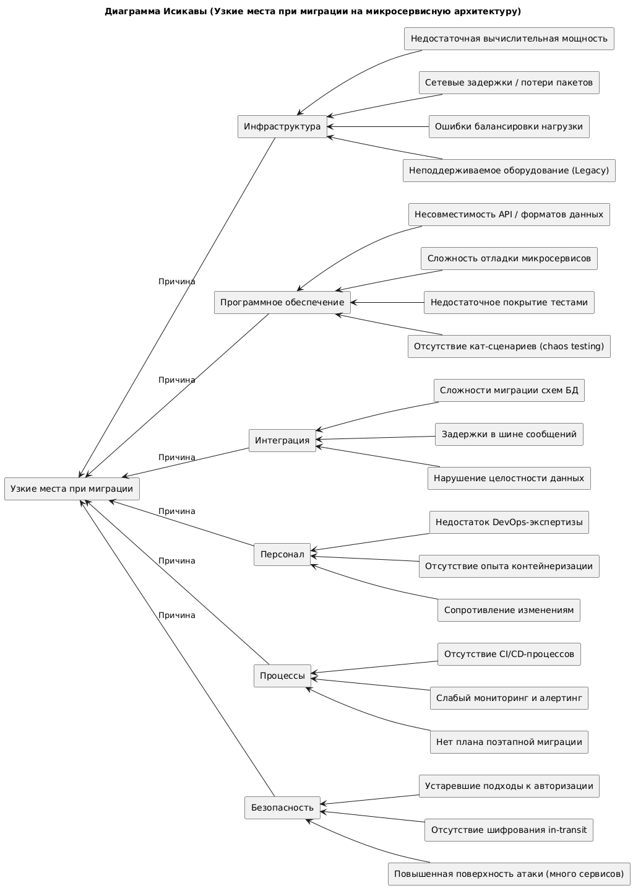

# Анализ: Оценка узких мест при миграции монолита

Компания мигрирует от монолитного приложения к микросервисной архитектуре. 
Цель — масштабируемость, изоляция компонентов, ускорение доставки. Однако это влечёт архитектурные, организационные и технические риски.

---

## Диаграмма Исикавы

---

## Выявленные проблемы (по категориям)

### 1. Инфраструктура

* Сервера не справляются с пиковыми нагрузками.
* Проблемы в сетевой маршрутизации, потери пакетов.
* Балансировщики настроены под монолит.
* Оборудование не поддерживает контейнеризацию.

### 2. Программное обеспечение

* Микросервисы не соблюдают единые API-спеки.
* Сложно трассировать баги из-за распределённости.
* Мало e2e-тестов и тестов деградации.
* Отсутствие Chaos Engineering → слабая устойчивость.

### 3. Интеграция

* Невозможно быстро мигрировать схемы БД.
* Задержки в Kafka / RabbitMQ.
* Нарушения eventual consistency между сервисами.

### 4. Персонал

* Нехватка знаний по Kubernetes, Helm, Terraform.
* Команды Dev → Ops не готовы к SRE-обязанностям.
* Боязнь изменений и нестабильности.

### 5. Процессы

* Нет production-grade CI/CD.
* Мониторинг не покрывает все сервисы.
* Не проработан roadmap миграции (Big Bang vs Strangler Pattern).

### 6. Безопасность

* Старые схемы авторизации (Basic Auth, сессии).
* Нет TLS между микросервисами.
* Каждый сервис — потенциальная точка атаки.

---

## Рекомендации и приоритеты

| Мера                                                                               | Категория       | Приоритет  |
| ---------------------------------------------------------------------------------- | --------------- | ---------- |
| Внедрить autoscaling и оценку ресурсов на основе нагрузки                          | Инфраструктура  | **Высокий** |
| Построить CI/CD пайплайн с тестами, деплоем, rollback                              | Процессы        | **Высокий** |
| Провести аудит API: ввести OpenAPI + версионирование                               | ПО / Интеграция | Средний |
| Настроить мониторинг (Prometheus + Grafana) и централизованный логинг (ELK, Loki)  | Процессы        | **Высокий** |
| Перейти на mTLS, внедрить Zero Trust подход                                        | Безопасность    | **Высокий** |
| Перевести базы на подход CQRS/Event Sourcing или CDC (Change Data Capture)         | Интеграция      | Низкий  |
| Провести тренинги DevOps / SRE, внедрить внутренние гайды по DevSecOps             | Персонал        | Средний |
| Использовать circuit breakers / bulkheads (например, Resilience4j)                 | ПО              | Средний |
| Внедрить механизм фазовой миграции (Strangler Pattern, Canary deploys, blue/green) | Процессы        | **Высокий** |